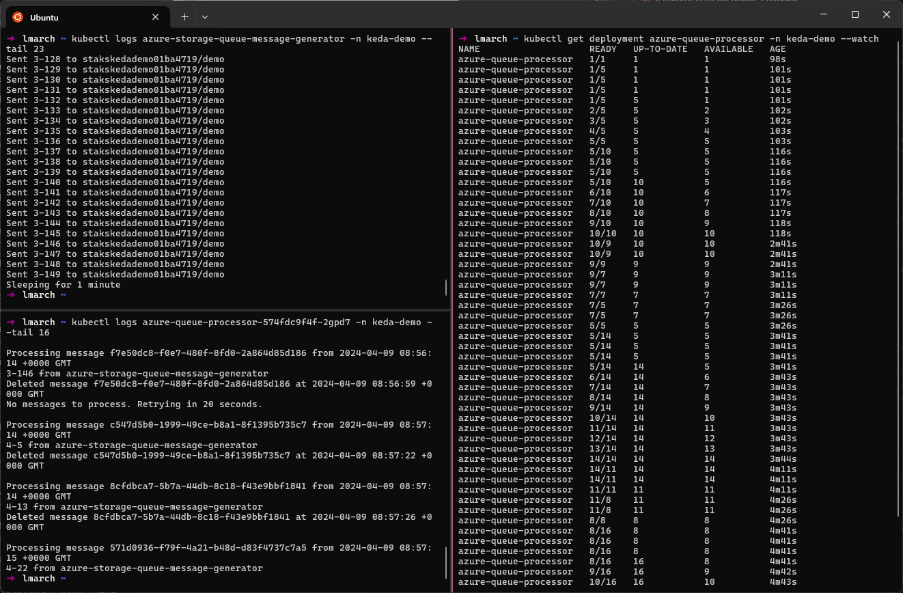
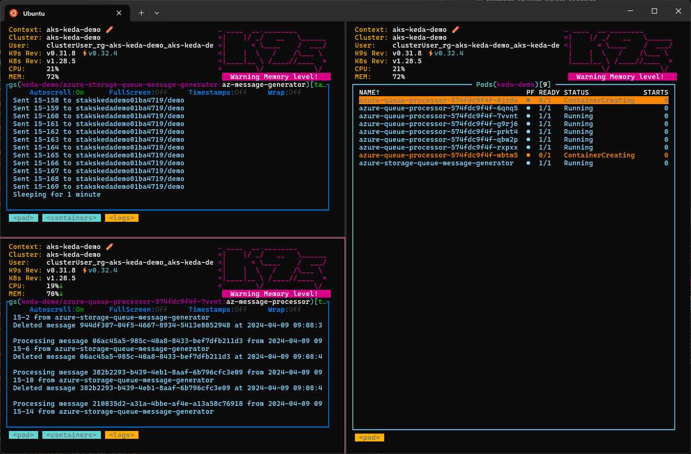
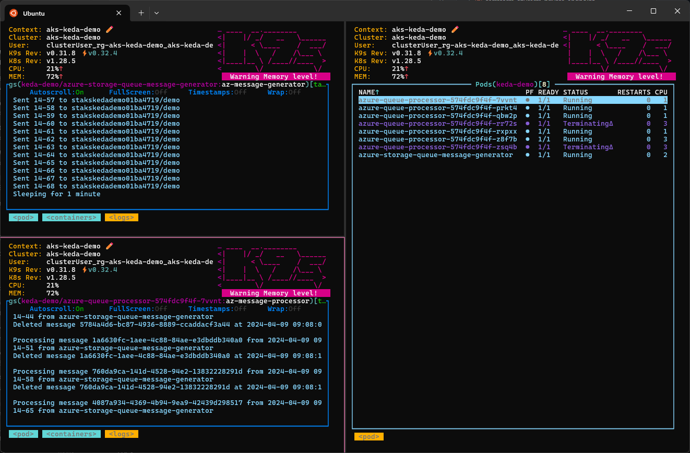
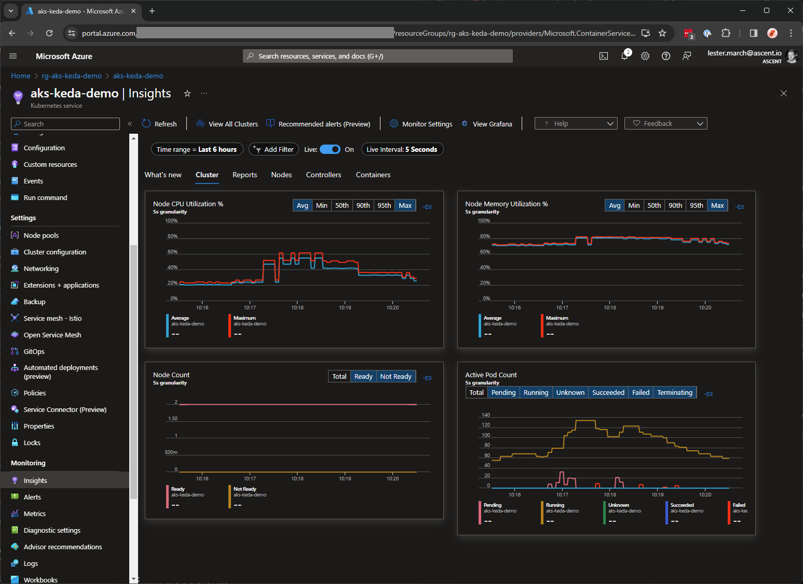

# Event-Driven Autoscaling (KEDA) with Azure Kubernetes Service (AKS)

## Summary

[Kubernetes Event-Drive Autoscaling](https://keda.sh/) (KEDA) is a component and extension of [Horizonal Pod Autoscaler](https://kubernetes.io/docs/tasks/run-application/horizontal-pod-autoscale/) (HPA) which can be added to any Kubernetes cluster, including [Azure Kubernetes Service](https://learn.microsoft.com/en-us/azure/aks/) (AKS), to reactively scale workloads based on various types of event.

### Video

The below video provides a very high-level overview and demo of this scenario:

[](https://youtu.be/2fhhBBiDoz0)

## Lab

This repo guides you though the setup of a lab environment to demonstrate the utility of KEDA with AKS. The lab is comprised of the following resources:

- **[Azure Storage Account and Queue](https://learn.microsoft.com/en-us/azure/storage/queues/)** - The _KEDA target_ which will be monitored by the AKS KEDA operator to determine scaling requirements.
- **[Azure Container Registry](https://learn.microsoft.com/en-us/azure/container-registry/)** - The registry for building and storing the container images used in this demonstration.
- **[Azure Kubernetes Service](https://learn.microsoft.com/en-us/azure/aks/)** - The compute environment used to demonstrate workload scaling with KEDA.
- **[Azure Managed Identity](https://learn.microsoft.com/en-us/entra/identity/managed-identities-azure-resources/overview)** - The identity used by the AKS workloads and KEDA operator to authenticate to Azure resources.
- (_Optional_) **[Azure Log Analytics Workspace](https://learn.microsoft.com/en-us/azure/azure-monitor/logs/log-analytics-workspace-overview)** - The log store used by AKS to enable Container Insights and view real-time workload metrics, including autoscaling behaviour.

### Overview

The objective of this lab is to demonstrate the autoscaling behaviour of KEDA, centered around an Azure storage queue. The queue is [monitored](https://keda.sh/docs/2.13/scalers/azure-storage-queue/) by the KEDA operator within the AKS cluster in order to determine scaling requirements.

To simulate a scalable workload, two apps are created to interact with the Azure storage account queue:

- A _Message Generator_ app will send a random number of messages to an Azure storage queue every 60 seconds. The lower and upper bounds for the number of messages can be set by the `MESSAGE_COUNT_PER_MINUTE_MAX` and `MESSAGE_COUNT_PER_MINUTE_MIN` environment variables.
- A _Message Processor_ app will receive messages from an Azure storage queue and simulate some amount of processing time. The processing time per message can be set with the `MESSAGE_PROCESSING_SECONDS` environment variable.

The concept here is that the _message generator_ will post batches of messages into the storage queue every 60 seconds. One or more _message processors_ will continually check the queue and retrieve, process, and delete the messages. However, each _message processor_ is only able to process a set number of messages per second, and so the number of _message processors_ will need to scale in order to work through the messages in the storage queue.

The _message generator_ app will be deployed as a Kubernetes pod on the AKS cluster, and use a workload identity to authenticate and post messages to the storage queue every 60 seconds.

The _message processor_  app will be deployed as a Kubernetes deployment on the AKS cluster, and use a workload identity to authenticate and retrieve, process and delete messages as quickly as it can. The deployment will be KEDA-enabled, allowing KEDA to scale the number of pods in the deployment based on the length of the storage queue. In this way, the deployment will effectively scale up and down based on current demand.

#### Examples

The lab can be tuned to simulate a workload by modifying the environment variables for each app.

- Setting the _message generator_ `MESSAGE_COUNT_PER_MINUTE_MAX` to `120` and `MESSAGE_COUNT_PER_MINUTE_MIN` to `12` with the _message processor_ `MESSAGE_PROCESSING_SECONDS` to `10` (6 messages/minute) will demonstrate a moderately scalable workload and should see KEDA scale the _message processor_ deployment between 2 and 20 pods.
- Setting the _message generator_ `MESSAGE_COUNT_PER_MINUTE_MAX` to `1200` and `MESSAGE_COUNT_PER_MINUTE_MIN` to `120` with the _message processor_ `MESSAGE_PROCESSING_SECONDS` to `10` (6 messages/minute) will demonstrate a highly scalable workload and should see KEDA scale the _message processor_ deployment between 20 and 200 pods.

### Setup

The following sections walk through the lab setup and configuration. By the end of these steps you should have a fully-functioning lab environment with a simulated workload demonstrating KEDA the autoscaling capability of KEDA.

- [1. Environment](#1-environment)
  * [1.1. Variables](#11-variables)
  * [1.2. Resource Group](#12-resource-group)
- [2. Storage](#2-storage)
  * [2.1. Variables](#21-variables)
  * [2.2. Account](#22-account)
  * [2.3. Queue](#23-queue)
- [3. Container Registry](#3-container-registry)
  * [3.1. Variables](#31-variables)
  * [3.2. Registry](#32-registry)
- [4. Azure Kubernetes Service](#4-azure-kubernetes-service)
  * [4.1. Variables](#41-variables)
  * [4.2. Cluster](#42-cluster)
  * [4.3. Permissions](#43-permissions)
- (_Optional_) [5. Monitoring](#optional-5-monitoring)
  * [5.1. Variables](#51-variables)
  * [5.2. Workspace](#52-workspace)
  * [5.3. Container Insights](#53-container-insights)
- [6. Workload Identity](#6-workload-identity)
  * [6.1. Variables](#61-variables)
  * [6.2. Authentication](#62-authentication)
  * [6.3. AKS Namespace](#63-aks-namespace)
  * [6.4. Managed Identity](#64-managed-identity)
  * [6.5. AKS Service Account](#65-aks-service-account)
  * [6.6. Identity Federation](#66-identity-federation)
- [7. Permissions](#7-permissions)
  * [7.1. Variables](#71-variables)
  * [7.2. Storage Account RBAC](#72-storage-account-rbac)
  * [7.3. Container Registry RBAC](#73-container-registry-rbac)
- [8. Applications](#8-applications)
  * [8.1. Variables](#81-variables)
  * [8.2. Image Build](#82-image-build)
- [9. Deployment](#9-deployment)
  * [9.1. Variables](#91-variables)
  * [9.2. Deployment](#92-deployment)
- [10. Load Testing](#10-load-testing)
  * [10.1. Variables](#101-variables)
  * [10.2. Testing](#102-testing)

> [!Note]
> The variables set during setup steps may be referenced by later steps. Take care to ensure these are not lost of overwritten during deployment.

### 1. Environment

In this section you configure a resource group to house the lab resources.

#### 1.1. Variables

Set some variables:

```bash
# Modify as preferred:
RESOURCE_GROUP_NAME="rg-aks-keda-demo"
LOCATION="uksouth"
```

#### 1.2. Resource Group

Create an Azure resource group for the lab resources:

```bash
az group create \
  --name $RESOURCE_GROUP_NAME \
  --location $LOCATION
```

### 2. Storage

In this section you create a storage account and queue to be used by the apps, and monitored by KEDA.

#### 2.1. Variables

Set some variables:

```bash
# Modify as preferred:
STORAGE_ACCOUNT_PREFIX="stakskedademo"
STORAGE_QUEUE_NAME="demo"

# Do not modify:
RESOURCE_GROUP_ID=$(az group show --name $RESOURCE_GROUP_NAME --query id -o tsv)
ENTROPY=$(echo $RESOURCE_GROUP_ID | sha256sum | cut -c1-8)
STORAGE_ACCOUNT_NAME="$STORAGE_ACCOUNT_PREFIX$ENTROPY"
```

#### 2.2. Account

Create an Azure storage account:

```bash
az storage account create \
  --name $STORAGE_ACCOUNT_NAME \
  --resource-group $RESOURCE_GROUP_NAME \
  --location $LOCATION \
  --sku "Standard_LRS" \
  --min-tls-version "TLS1_2"
```

#### 2.3. Queue

Create an Azure storage queue:

```bash
az storage queue create \
  --name $STORAGE_QUEUE_NAME \
  --account-name $STORAGE_ACCOUNT_NAME \
  --auth-mode "login"
```

### 3. Container Registry

In this section you create a container registry to build and host the apps ready for deployment into the AKS cluster.

#### 3.1. Variables

Set some variables:

```bash
# Modify as preferred:
ACR_PREFIX="acrakskedademo"

# Do not modify:
ACR_NAME="$ACR_PREFIX$ENTROPY"
```

#### 3.2. Registry

Create an Azure container registry:

```bash
az acr create \
  --name $ACR_NAME \
  --location $LOCATION \
  --resource-group $RESOURCE_GROUP_NAME \
  --sku "Basic"
```

### 4. Azure Kubernetes Service

In this section you create an AKS cluster to run the apps. There are several notable configuration options:

- `--enable-managed-identity` creates a managed identity for the AKS cluster to enable the use of Azure RBAC to authenticate and authorise the cluster to interface with other Azure resources.
- `--attach-acr` links the AKS cluster to the container registry and configures the relevant permissions on the container registry for AKS to be able to pull images using its managed identity.
- `--enable-oidc-issuer` and `--enable-workload-identity` provide the ability for Azure user-assigned managed identities to be federated to AKS service accounts and used by pods. Azure RBAC can then be used to authenticate and authorise pods to interface with other Azure resources.
- `--enable-keda` provisions the KEDA components into the AKS cluster `kube-system` namespace. This includes the KEDA operator service account which can have an Azure used-assigned managed identity federated to it in order for Azure RBAC to be used to authenticate and authorise KEDA to interface with other Azure resources.
- `--enable-cluster-autoscaler` along with `--max-count` and `--min-count` allows the AKS cluster nodepool to automatically scale the number of ndoes based on cluster load. If the number of required pods exceeds the current nodepool capacity during the lab, the cluster autoscaling behaviour may be observed.

#### 4.1. Variables

Set some variables:

```bash
# Modify as preferred:
AKS_CLUSTER_NAME="aks-keda-demo"

# Do not modify:
ACR_ID=$(az acr show --name $ACR_NAME --resource-group $RESOURCE_GROUP_NAME --query id -o tsv)
USER_ID=$(az ad signed-in-user show --query id -o tsv)
```

#### 4.2. Cluster

Create an AKS cluster:

```bash
az aks create \
  --name $AKS_CLUSTER_NAME \
  --resource-group $RESOURCE_GROUP_NAME \
  --location $LOCATION \
  --attach-acr $ACR_ID \
  --disable-local-accounts \
  --enable-aad \
  --enable-azure-rbac \
  --enable-cluster-autoscaler \
  --enable-keda \
  --enable-managed-identity \
  --enable-oidc-issuer \
  --enable-workload-identity \
  --generate-ssh-keys \
  --min-count 2 \
  --max-count 6 \
  --network-dataplane "cilium" \
  --network-plugin "azure" \
  --network-plugin-mode "overlay" \
  --network-policy "cilium" \
  --node-count 2 \
  --os-sku "AzureLinux" \
  --pod-cidr "172.100.0.0/16" \
  --tier "standard" \
  --zones 1 2 3
```

#### 4.3. Permissions

Grant yourself the `Azure Kubernetes RBAC Cluster Admin` role on the AKS cluster:

```bash
AKS_CLUSTER_ID=$(az aks show --name $AKS_CLUSTER_NAME --resource-group $RESOURCE_GROUP_NAME --query id -o tsv)

az role assignment create \
  --assignee-object-id $USER_ID \
  --assignee-principal-type "User" \
  --role "Azure Kubernetes Service RBAC Cluster Admin" \
  --scope $AKS_CLUSTER_ID
```

### (Optional) 5. Monitoring

In this optional section you provision a log analytics workspace and install the monitoring addon for AKS to enable container insights. This is recommended to enable a graphical view into the scaling operations during the lab.

#### 5.1. Variables

Set some variables:

```bash
# Modify as preferred:
LOG_WORKSPACE_NAME="log-keda-demo"
```

#### 5.2. Workspace

Create an Azure log analytics workspace:

```bash
az monitor log-analytics workspace create \
  --name $LOG_WORKSPACE_NAME \
  --location $LOCATION \
  --resource-group $RESOURCE_GROUP_NAME
```

#### 5.3. Container Insights

```bash
LOG_WORKSPACE_ID=$(az monitor log-analytics workspace show --name $LOG_WORKSPACE_NAME --resource-group $RESOURCE_GROUP_NAME --query id -o tsv)

az aks enable-addons \
  --name $AKS_CLUSTER_NAME \
  --resource-group $RESOURCE_GROUP_NAME \
  --addon "monitoring" \
  --workspace-resource-id $LOG_WORKSPACE_ID
```

### 6. Workload Identity

In this section you provision an Azure user-assigned identity and federate it with AKS service accounts including the KEDA operator and workload service account.

> [!Note]
> For simplicity, a single user-assigned identity is used for both the KEDA operator service account and workload service account (used by both applications). In practice, a separate user-assigned identity should be created and federated with the KEDA operator to delineate the permissions required by KEDA (usually read-only) and the permissions required by workload applications.

#### 6.1. Variables

Set some variables:

```bash
# Modify as preferred:
NAMESPACE="keda-demo"
WORKLOAD_IDENTITY_NAME="uid-aks-keda-demo"

# Do not modify:
AKS_OIDC_ISSUER=$(az aks show --name $AKS_CLUSTER_NAME --resource-group $RESOURCE_GROUP_NAME --query "oidcIssuerProfile.issuerUrl" -o tsv)
```

#### 6.2. Authentication

Get your AKS credentials for authentication:

```bash
az aks get-credentials \
  --name $AKS_CLUSTER_NAME \
  --resource-group $RESOURCE_GROUP_NAME
```

#### 6.3. AKS Namespace

Create an AKS namespace:

```bash
cat <<EOF | kubectl apply -f -
apiVersion: v1
kind: Namespace
metadata:
  name: "${NAMESPACE}"
EOF
```

#### 6.4. Managed Identity

Create an Azure managed identity:

```bash
az identity create \
  --name $WORKLOAD_IDENTITY_NAME \
  --resource-group $RESOURCE_GROUP_NAME \
  --location $LOCATION
```

#### 6.5. AKS Service Account

```bash
WORKLOAD_IDENTITY_CLIENT_ID=$(az identity show --name $WORKLOAD_IDENTITY_NAME --resource-group $RESOURCE_GROUP_NAME --query clientId -o tsv)
WORKLOAD_IDENTITY_TENANT_ID=$(az identity show --name $WORKLOAD_IDENTITY_NAME --resource-group $RESOURCE_GROUP_NAME --query tenantId -o tsv)

cat <<EOF | kubectl apply -f -
apiVersion: v1
kind: ServiceAccount
metadata:
  annotations:
    azure.workload.identity/client-id: "${WORKLOAD_IDENTITY_CLIENT_ID}"
    azure.workload.identity/tenant-id: "${WORKLOAD_IDENTITY_TENANT_ID}"
  name: "${WORKLOAD_IDENTITY_NAME}"
  namespace: "${NAMESPACE}"
EOF
```

#### 6.6. Identity Federation

Federate the Azure managed identity and AKS service account:

```bash
az identity federated-credential create \
  --name "aks-sa-$WORKLOAD_IDENTITY_NAME" \
  --resource-group $RESOURCE_GROUP_NAME \
  --identity-name $WORKLOAD_IDENTITY_NAME \
  --issuer $AKS_OIDC_ISSUER \
  --subject system:serviceaccount:$NAMESPACE:$WORKLOAD_IDENTITY_NAME \
  --audiences api://AzureADTokenExchange
```

Federate the Azure managed identity and KEDA operator service account:

```bash
az identity federated-credential create \
  --name "aks-sa-keda-operator" \
  --resource-group $RESOURCE_GROUP_NAME \
  --identity-name $WORKLOAD_IDENTITY_NAME \
  --issuer $AKS_OIDC_ISSUER \
  --subject system:serviceaccount:kube-system:keda-operator \
  --audiences api://AzureADTokenExchange
```

### 7. Permissions

In this section you configure Azure RBAC for both the storage account and container registry, assigning permissions both to yourself and also to the user-assigned identity used by both the apps and KEDA operator.

#### 7.1. Variables

Set some variables:

```bash
# Do not modify:
STORAGE_ACCOUNT_ID=$(az storage account show --name $STORAGE_ACCOUNT_NAME --resource-group $RESOURCE_GROUP_NAME --query id -o tsv)
WORKLOAD_IDENTITY_PRINCIPAL_ID=$(az identity show --name $WORKLOAD_IDENTITY_NAME --resource-group $RESOURCE_GROUP_NAME --query principalId -o tsv)
```

#### 7.2. Storage Account RBAC

Grant yourself the `Storage Queue Data Contributor` role on the storage account:

```bash
az role assignment create \
  --assignee-object-id $USER_ID \
  --assignee-principal-type "User" \
  --role "Storage Queue Data Contributor" \
  --scope $STORAGE_ACCOUNT_ID
```

Grant the Azure managed identity the `Storage Queue Data Contributor` role on the storage account:

```bash
az role assignment create \
  --assignee-object-id $WORKLOAD_IDENTITY_PRINCIPAL_ID \
  --assignee-principal-type "ServicePrincipal" \
  --role "Storage Queue Data Contributor" \
  --scope $STORAGE_ACCOUNT_ID
```

#### 7.3. Container Registry RBAC

Grant yourself the `AcrPush` role on the container registry:

```bash
az role assignment create \
  --assignee-object-id $USER_ID \
  --assignee-principal-type "User" \
  --role "AcrPush" \
  --scope $ACR_ID
```

### 8. Applications

In this section you use the container registry to build the container images ready for deployment into the AKS cluster.

#### 8.1. Variables

Set some variables:

```bash
# Modify as preferred:
MESSAGE_GENERATOR_IMAGE_NAME="az-message-generator"
MESSAGE_PROCESSOR_IMAGE_NAME="az-message-processor"
```

#### 8.2. Image Build

Build the Azure storage message generator image:

```bash
az acr build \
  --registry $ACR_NAME \
  --image $MESSAGE_GENERATOR_IMAGE_NAME:{{.Run.ID}} \
  apps/az-message-generator
```

Build the Azure storage message processor image:

```bash
az acr build \
  --registry $ACR_NAME \
  --image $MESSAGE_PROCESSOR_IMAGE_NAME:{{.Run.ID}} \
  apps/az-message-processor
```

### 9. Deployment

In this section you deploy the _message processor_ application as a Kubernetes deployment. KEDA is then configured for this deployment by creating both a trigger authentication and scaled object component.

#### 9.1. Variables

Set some variables:

```bash
# Modify as preferred:
AUTH_TRIGGER_NAME="azure-queue-auth"
DEPLOYMENT_NAME="azure-queue-processor"
MESSAGE_PROCESSING_SECONDS="3"
SCALED_OBJECT_NAME="azure-queue-scaler"
SCALING_QUEUE_LENGTH="10"

# Do not modify:
ACR_LOGIN_SERVER=$(az acr show --name $ACR_NAME --resource-group $RESOURCE_GROUP_NAME --query loginServer -o tsv)
MESSAGE_PROCESSOR_IMAGE_TAG=$(az acr repository show-tags --name $ACR_NAME --repository $MESSAGE_PROCESSOR_IMAGE_NAME --orderby time_desc --top 1 --query '[0]' -o tsv)
```

#### 9.2. Deployment

Create an Azure storage message processor deployment:

```bash
cat <<EOF | kubectl apply -f -
apiVersion: apps/v1
kind: Deployment
metadata:
  name: "${DEPLOYMENT_NAME}"
  namespace: "${NAMESPACE}"
spec:
  selector:
    matchLabels:
      app: "${DEPLOYMENT_NAME}"
  template:
    metadata:
      labels:
        app: "${DEPLOYMENT_NAME}"
        azure.workload.identity/use: "true"
    spec:
      serviceAccountName: "${WORKLOAD_IDENTITY_NAME}"
      containers:
      - name: "${MESSAGE_PROCESSOR_IMAGE_NAME}"
        image: "${ACR_LOGIN_SERVER}/${MESSAGE_PROCESSOR_IMAGE_NAME}:${MESSAGE_PROCESSOR_IMAGE_TAG}"
        env:
        - name: AZURE_CLIENT_ID
          value: "${WORKLOAD_IDENTITY_CLIENT_ID}"
        - name: MESSAGE_PROCESSING_SECONDS
          value: "${MESSAGE_PROCESSING_SECONDS}"
        - name: STORAGE_ACCOUNT_NAME
          value: "${STORAGE_ACCOUNT_NAME}"
        - name: STORAGE_QUEUE_NAME
          value: "${STORAGE_QUEUE_NAME}"
EOF
```

#### 9.3. Enable KEDA

Create a KEDA trigger authentication:

```bash
cat <<EOF | kubectl apply -f -
apiVersion: keda.sh/v1alpha1
kind: TriggerAuthentication
metadata:
  name: "${AUTH_TRIGGER_NAME}"
  namespace: "${NAMESPACE}"
spec:
  podIdentity:
    identityId: "${WORKLOAD_IDENTITY_CLIENT_ID}"
    provider: azure-workload
EOF
```

Create a KEDA scaling object:

```bash
cat <<EOF | kubectl apply -f -
apiVersion: keda.sh/v1alpha1
kind: ScaledObject
metadata:
  name: "${SCALED_OBJECT_NAME}"
  namespace: "${NAMESPACE}"
spec:
  scaleTargetRef:
    name: "${DEPLOYMENT_NAME}"
  pollingInterval: 10
  cooldownPeriod: 60
  minReplicaCount: 1
  maxReplicaCount: 250
  advanced:
    restoreToOriginalReplicaCount: true
    horizontalPodAutoscalerConfig:
      name: "${SCALED_OBJECT_NAME}-hpa"
      behavior:
        scaleDown:
          stabilizationWindowSeconds: 30
          policies:
          - type: Percent
            value: 100
            periodSeconds: 10
  triggers:
  - type: azure-queue
    metadata:
      accountName: "${STORAGE_ACCOUNT_NAME}"
      queueName: "${STORAGE_QUEUE_NAME}"
      queueLength: "${SCALING_QUEUE_LENGTH}"
    authenticationRef:
      name: "${AUTH_TRIGGER_NAME}"
EOF
```

### 10. Load Testing

In this section you deploy the _message generator_ application as a Kubernetes pod to begin load-testing the solution.

#### 10.1. Variables

Set some variables:

```bash
# Modify as preferred:
MESSAGE_COUNT_PER_MINUTE_MAX="256"
MESSAGE_COUNT_PER_MINUTE_MIN="32"

# Do not modify:
MESSAGE_GENERATOR_IMAGE_TAG=$(az acr repository show-tags --name $ACR_NAME --repository $MESSAGE_GENERATOR_IMAGE_NAME --orderby time_desc --top 1 --query '[0]' -o tsv)
```

#### 10.2. Testing

Create an Azure storage message generator pod:

```bash
cat <<EOF | kubectl apply -f -
apiVersion: v1
kind: Pod
metadata:
  labels:
    app: azure-storage-queue-message-generator
    azure.workload.identity/use: "true"
  name: azure-storage-queue-message-generator
  namespace: $NAMESPACE
spec:
  serviceAccountName: $WORKLOAD_IDENTITY_NAME
  containers:
  - name: $MESSAGE_GENERATOR_IMAGE_NAME
    image: $ACR_LOGIN_SERVER/$MESSAGE_GENERATOR_IMAGE_NAME:$MESSAGE_GENERATOR_IMAGE_TAG
    env:
    - name: AZURE_CLIENT_ID
      value: "${WORKLOAD_IDENTITY_CLIENT_ID}"
    - name: MESSAGE_COUNT_PER_MINUTE_MAX
      value: "${MESSAGE_COUNT_PER_MINUTE_MAX}"
    - name: MESSAGE_COUNT_PER_MINUTE_MIN
      value: "${MESSAGE_COUNT_PER_MINUTE_MIN}"
    - name: STORAGE_ACCOUNT_NAME
      value: "${STORAGE_ACCOUNT_NAME}"
    - name: STORAGE_QUEUE_NAME
      value: "${STORAGE_QUEUE_NAME}"
EOF
```

#### 10.3. Monitoring

Monitor the solution natively using `kubectl`:



> [!Tip]
> The following commands are used here to monitor activity:
>
> - `kubectl logs azure-storage-queue-message-generator -n keda-demo` - View message generation activity.
> - `kubectl logs azure-queue-processor-{podId} -n keda-demo` - View message processing activity for a single message processor instance.
> - `kubectl get deployment azure-queue-processor -n keda-demo --watch` - View the change in the number of deployment replicas being managed by KEDA in response to storage queue length.

Monitor the solution using the [k9s](https://k9scli.io/) command-line tool:





Monitor the solution using container insights (if you followed [step 5](#optional-5-monitoring)):


